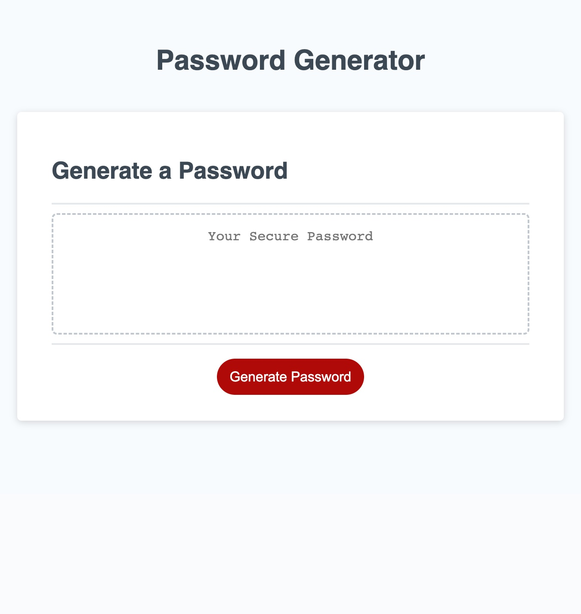

# Password Generator Challenge

## Description

Password Generator Challenge was created to exercise our introductory skills of JavaScript. THe goal of this challenge was to generate a random password by prompting the user to answer questions about the password specifications. This was done using window prompts and alerts. I learned a lot about for-loops, arrays, functions, and strings, and how to manipulated them to generate a random password.

## Links

https://samkstark.github.io/password-generator-challenge/
https://github.com/samkstark/password-generator-challenge

## Usage

